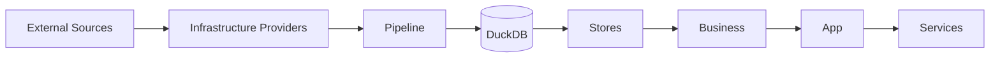

# SimLab

SimLab is an experimental data laboratory focused on building analytical services over company data while keeping clear boundaries between domain logic, data access, infrastructure, and orchestration.

The project is currently in an **MVP / early architecture** stage.

Its first use case is an Opportunity service that combines customer, product, and transaction data without coupling the business layer to the systems that provide or persist those data.

## Architecture

SimLab separates data preparation from application execution.



The main architectural rule is simple:

> External systems belong to infrastructure.
> Business logic should only know the data and capabilities it needs.

## Data pipeline

The pipeline is responsible for reading data from external sources, validating it, and materializing it into the internal analytical database.

```text
Tableau / Databricks
        ↓
      Reader
        ↓
   Pipeline Step
        ↓
     Validate
        ↓
Replacer / Appender
        ↓
      DuckDB
```

The pipeline does not depend on the business or application layers.

Its responsibility is to prepare internal data that can later be consumed by stores.

## Application flow

The application side starts from persisted data and moves toward higher-level business behavior.

```text
DuckDB
  ↓
Store
  ↓
Business
  ↓
App
  ↓
Service
```

Each layer has a specific responsibility.

### Store

Stores provide access to persisted data.

Current stores are backed by DuckDB.

```text
CustomerDuckStore
ProductDuckStore
TransactionDuckStore
```

### Business

The business layer contains domain-specific behavior.

Current domains include:

* Customer
* Product
* Transaction

Each domain has its own bus and store boundary.

Business buses do not communicate directly with other business buses.

Cross-domain orchestration happens at a higher layer.

### App

`App` acts as a façade over the business layer.

It provides a stable interface that higher-level services can use without directly depending on individual business components.

### Services

Services implement application-level use cases that may involve multiple domains.

The first service currently being explored is:

```text
OportunityService
```

Its purpose is to identify business opportunities by combining information exposed through the application façade.

## Project structure

```text
simlab/
├── __main__.py
├── cli.py
├── config/
│   └── sources/
│
└── src/
    ├── app/
    │
    ├── bootstrap/
    │
    ├── business/
    │   ├── domain/
    │   │   ├── customer/
    │   │   ├── product/
    │   │   └── transaction/
    │   │
    │   └── type/
    │
    ├── infra/
    │   ├── config/
    │   │
    │   ├── pipeline/
    │   │   ├── runner.py
    │   │   ├── steps.py
    │   │   └── validate.py
    │   │
    │   └── providers/
    │       ├── databricks/
    │       ├── duckdb/
    │       └── tableau/
    │
    ├── service/
    │   └── oportunity/
    │
    └── store/
        ├── customer/
        ├── product/
        └── transaction/
```

## Pipeline design

The pipeline is built around capabilities instead of concrete technologies.

### Reader

A `Reader` knows how to read a resource and return a DataFrame.

```python
class Reader(Protocol):
  def read(
    self,
    resource_id: str,
    *args,
    **kwargs
  ) -> pd.DataFrame:
    ...
```

Tableau and Databricks can implement this capability independently.

### Replacer

A `Replacer` knows how to replace a persisted table.

```python
class Replacer(Protocol):
  def replace(
    self,
    table: str,
    df: pd.DataFrame
  ) -> None:
    ...
```

### Appender

An `Appender` knows how to append data to an existing table.

```python
class Appender(Protocol):
  def append(
    self,
    table: str,
    df: pd.DataFrame
  ) -> None:
    ...
```

### Step

A pipeline step represents an executable operation.

```python
class Step(Protocol):
  def run(self) -> None:
    ...
```

The runner only depends on this capability:

```python
def runner(*steps: Step) -> None:
  for step in steps:
    step.run()
```

This means the runner does not need to know whether a step is reading from Tableau, Databricks, or any other future provider.

## Source steps

The first available pipeline strategies are:

```text
SourceReplacer
SourceAppender
```

Both share the same flow:

```text
read
 ↓
validate
 ↓
persist
```

The difference is only the persistence strategy.

```text
SourceReplacer
      ↓
replace table
```

```text
SourceAppender
      ↓
append rows
```

## DuckDB

DuckDB is currently used as the internal analytical database.

The pipeline persists data into:

```text
simlab.duckdb
```

The same database is consumed by the application stores.

This creates a clear integration boundary between pipeline and business:

```text
External Source
      ↓
Pipeline
      ↓
simlab.duckdb
      ↓
Store
      ↓
Business
```

The pipeline and business layers do not directly know each other.

They communicate through persisted internal data.

## Running

The CLI currently exposes two commands.

### Run the pipeline

```powershell
python . pipeline
```

This executes the infrastructure pipeline and materializes data into DuckDB.

### Run the application

```powershell
python . app
```

This bootstraps the application by composing:

```text
DuckDB
  ↓
Stores
  ↓
Business buses
  ↓
App
  ↓
Services
```

## Current providers

### DuckDB

Currently supports:

```text
replace
append
```

The provider is responsible only for persistence behavior.

It does not know anything about Customer, Product, Transaction, or other business concepts.

### Tableau

The current Tableau provider exposes resource-specific readers such as:

```python
tableau.workbook()
tableau.datasource()
```

These readers satisfy the pipeline `Reader` capability.

The real Tableau integration is still under development.

### Databricks

The Databricks provider currently exists as an initial scaffold.

Its real integration is still under development.

## Data validation

Pipeline data is validated before persistence.

The current schema format is intentionally simple:

```python
schema = {
  "id": "string",
  "amount": "float",
  "created_at": "datetime"
}
```

Supported types currently include:

```text
string
int
float
bool
datetime
```

The validator checks:

* required columns
* supported schema types
* DataFrame column types

Validation does not modify or coerce incoming data.

Transformation and normalization should happen before validation.

## Current status

Implemented:

* CLI command routing
* `pipeline` and `app` execution modes
* bootstrap / composition root
* Customer domain
* Product domain
* Transaction domain
* DuckDB-backed stores
* pipeline runner
* capability-based pipeline protocols
* source replace step
* source append step
* DataFrame schema validation
* DuckDB replace persistence
* DuckDB append persistence
* Tableau provider structure
* Databricks provider scaffold
* initial Opportunity service structure

Still under development:

* real Tableau authentication and data extraction
* real Databricks integration
* production configuration
* secrets management
* automated tests
* dependency packaging
* Opportunity service behavior
* analytical and machine learning models
* production observability
* pipeline execution metadata

## Design principles

SimLab currently follows a few important architectural principles.

### Domain isolation

Each business domain owns its own rules and store contract.

```text
CustomerBus
    ↓
CustomerStore
```

```text
ProductBus
    ↓
ProductStore
```

```text
TransactionBus
    ↓
TransactionStore
```

A business bus should not depend directly on another business bus.

### Infrastructure isolation

Business code should not depend on:

```text
Tableau
Databricks
DuckDB
HTTP
SDKs
external APIs
```

Those concerns belong to infrastructure.

### Capability-based integration

Components depend on behavior instead of concrete implementations.

```text
Reader
Replacer
Appender
Step
```

This allows infrastructure providers to evolve independently.

### Explicit orchestration

Cross-domain use cases belong above the business layer.

```text
Business
   ↓
 App
   ↓
Service
```

This avoids hidden coupling between domains.

### Explicit materialization

External data is first materialized into internal storage before being exposed to the business layer.

```text
external data
     ↓
pipeline
     ↓
internal tables
     ↓
stores
```

This makes the internal data model independent from the topology of external systems.

## Roadmap

Short-term priorities:

```text
1. Complete Tableau datasource integration
2. Materialize the first real dataset into DuckDB
3. Connect CustomerStore to the materialized customer table
4. Add Product and Transaction pipelines
5. Introduce automated pipeline tests
6. Formalize project dependencies
7. Expand OportunityService
8. Introduce analytical / ML models
```

Longer term, SimLab is intended to become a reusable analytical platform where new providers, domains, services, and models can be introduced without collapsing architectural boundaries.
